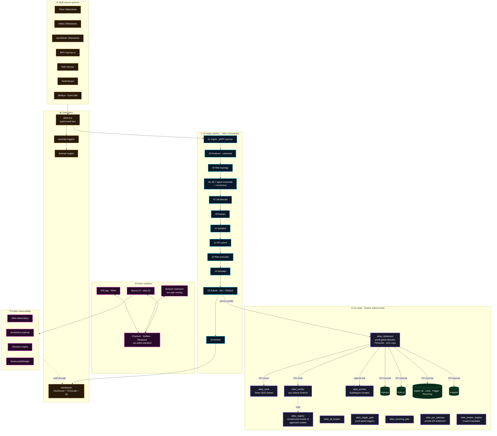
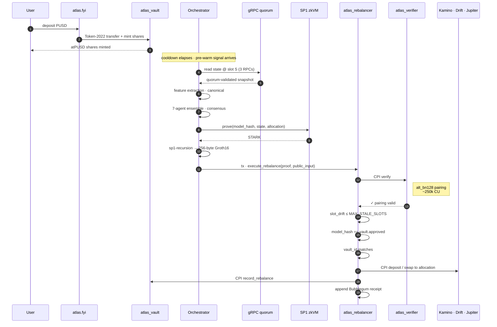
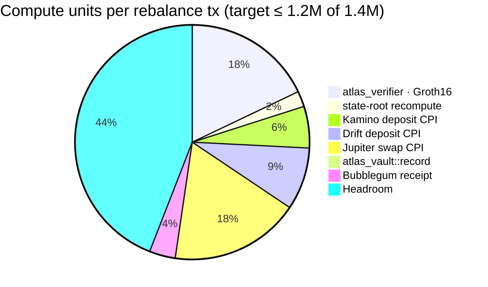
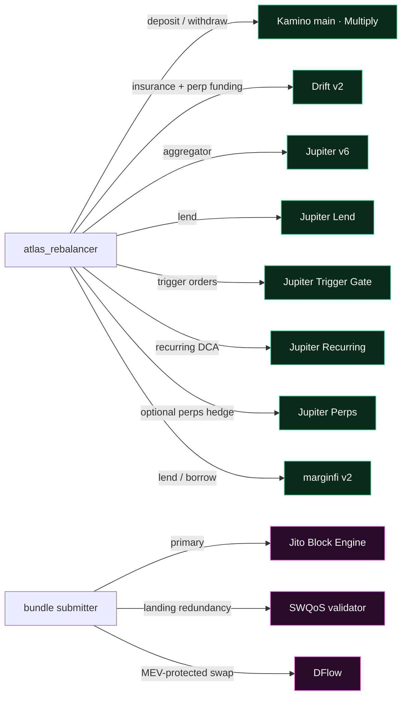
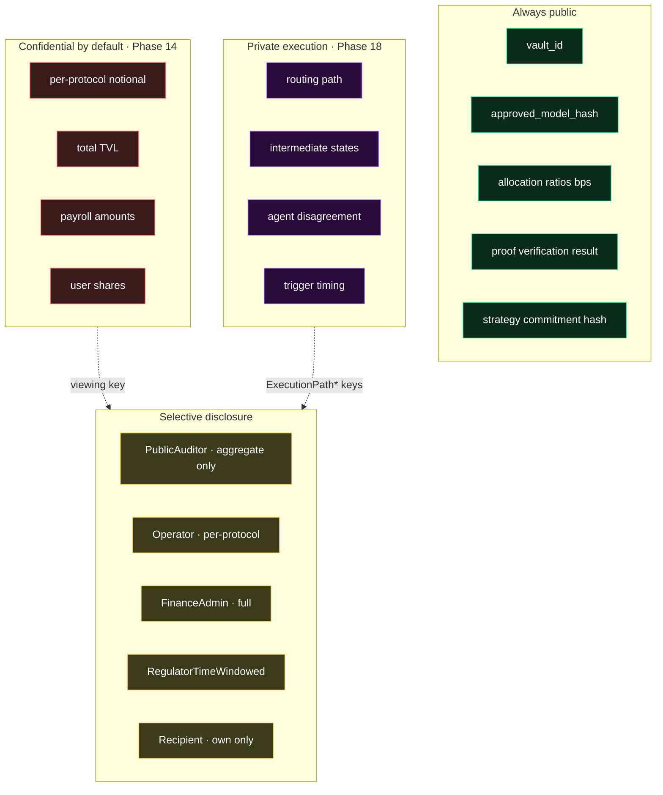
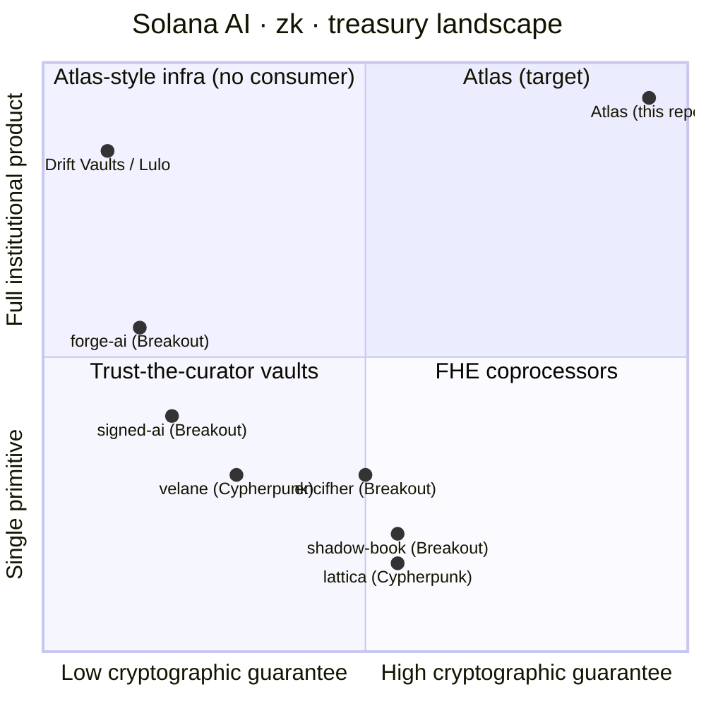

<div align="center">

# ⚡ Atlas

### Autonomous, zk-verified treasury infrastructure for stablecoin capital on Solana.

AI manages allocations across audited DeFi venues. Every rebalance ships a Groth16 proof verified onchain. Treasuries pre-warm liquidity before payouts. Amounts can be confidential. Execution paths can be private. Every claim is publicly verifiable.

<br/>

[](https://www.colosseum.com)
[](https://succinct.xyz)
[](https://www.anchor-lang.com)
[](https://github.com/anza-xyz/pinocchio)
[](https://spl.solana.com/token-2022)
[](./LICENSE)

<br/>


<br/>

[**🌐 atlas.fyi**](https://atlas.fyi) · [**📦 SDK (npm)**](sdk/ts) · [**📦 SDK (crates.io)**](sdk/rust) · [**🧪 Playground**](sdk/playground) · [**🧠 Architecture**](#system-architecture) · [**🛡 Security**](#trust-model)

</div>

---

## TL;DR

Every "AI yield vault" on Solana asks depositors to **trust the curator**. Atlas removes that requirement.

The strategy is committed at vault creation as a Poseidon hash. The AI agent can only rebalance with a fresh **SP1 zkVM proof**. The Solana program **rejects the transaction** if the proof, the slot, the model hash, or the vault id don't match. Treasuries get cashflow-aware liquidity pre-warming. Allocations can be made confidential at the amount layer (Token-2022 + Pedersen commitments) and private at the execution layer (MagicBlock ephemeral rollups). Auditors keep selective viewing-key access.

> **Trust the math, not the team.**

Three product surfaces, one repo:

| Layer | What |
|---|---|
| 🧮 **Atlas Protocol** | Open zkML coprocessor — any Solana program calls `verify_inference(model_hash, input, proof)` via CPI |
| 🏦 **Atlas Vault** | Token-2022 vault, proof-gated rebalancing across Kamino · Drift · Jupiter · marginfi · Jupiter Lend |
| 🏛 **Atlas Treasury OS** | Business + DAO treasury entities, Squads-multisig admin, payment pre-warm, runway forecast, invoice intelligence, unified ledger |

---

## Why now

| Constraint | Solana 2026 | EVM mainnet |
|---|---|---|
| Onchain Groth16 verification | **~$0.0001** (`alt_bn128` syscalls) | $5+ |
| Block time | 400 ms | ~12 s |
| Per-rebalance proof economics | viable for retail TVL | research-grade only |
| Token confidentiality | Token-2022 native | snarkVM / Aztec L2 |
| Sub-slot account streaming | Yellowstone gRPC quorum | none |
| Compressed receipts | SPL Account Compression / Bubblegum | none |
| Private execution | MagicBlock Ephemeral Rollups | research-grade only |

`sp1-solana` Groth16 verifier is **production-shipped on mainnet** by Light Protocol + Succinct. Atlas composes audited primitives — it does not invent cryptography.

---

## System architecture



---

## End-to-end proof lifecycle



If **any** check fails — proof, slot, model, vault id, post-condition — the entire bundle reverts before any user funds move.

---

## Invariants (non-negotiable)

| ID | Invariant | Enforced by |
|---|---|---|
| **I-1** | Strategy immutability after vault creation | program rejection + CI test |
| **I-2** | Proof-gated state movement | only `atlas_rebalancer` can move principal |
| **I-3** | Three-gate rebalance · cryptographic + freshness + authorization | program short-circuits |
| **I-4** | Canonical 268-byte public input v2 | shared `atlas-public-input` crate |
| **I-5** | No floats in proof inputs · `[u32; N]` bps summing to 10_000 | guest assertion |
| **I-6** | Deterministic ordering for any Poseidon-bound collection | clippy lint |
| **I-7** | No silent fallbacks · typed errors only | no `Default` substitution |
| **I-8** | Replay archival before bundle submission | sequence enforced |
| **I-9** | Single source of public-input truth | duplicated logic = CI fail |
| **I-10** | Cross-program post-condition checks on every CPI | snapshot diff |
| **I-11** | Token-2022 extension allowlist (no `PermanentDelegate`, `TransferHook`, `DefaultAccountState=Frozen`, `NonTransferable`) | manifest match |
| **I-12** | No `unwrap` / `expect` / `panic!` reachable in production | clippy `disallowed_methods` |
| **I-13–17** | Phase 14 confidentiality: ratios public, notionals confidential, viewing-key scoped, no silent unblinding | program + warehouse audit |
| **I-18–21** | Phase 15 keeper scope: per-role keys, mandate ratcheting, independent execution-time attestation | `atlas_keeper_registry` |
| **I-22–25** | Phase 18 private execution: ER settlement bound, verifier accepts only ER-rooted transitions, lifelong privacy mode, disclosure policy required | `atlas_per_gateway` |

---

## 16-stage pipeline

```mermaid
graph LR
    A[01 Ingest<br/>gRPC quorum] --> B[02 Normalize]
    B --> C[03 Features<br/>canonical]
    C --> D[04 Risk topology]
    D --> E[05 Agents<br/>7-ensemble]
    E --> F[06 Consensus]
    F --> G[07 Constraints]
    G --> H[08 Allocate<br/>bps]
    H --> I[09 Explain<br/>structured]
    I --> J[10 Serialize<br/>268B canonical]
    J --> K[11 Prove<br/>SP1 → Groth16]
    K --> L[12 Plan<br/>ALT + CU]
    L --> M[13 Synth tx<br/>Versioned]
    M --> N[14 Simulate]
    N --> O[15 Submit<br/>Jito + SWQoS]
    O --> P[16 Archive<br/>Bubblegum]

    classDef live fill:#1a1a2e,stroke:#7c5cff,color:#fff
    classDef commit fill:#3a1a3a,stroke:#ff5cf0,color:#fff
    classDef chain fill:#0a2a1a,stroke:#29d391,color:#fff
    class A,B,C,D,E,F,G,H live
    class I,J,K commit
    class L,M,N,O,P chain
```



Every stage emits OpenTelemetry. Every stage supports `replay()`. Stages 01–14 are deterministic and idempotent; only stage 15 has external side effects.

---

## Public input v2 (268 bytes)

```text
┌─────────┬──────┬─────────────────────────────────────────────────────────┐
│ offset  │ size │ field                                                   │
├─────────┼──────┼─────────────────────────────────────────────────────────┤
│   0     │   1  │ version  · 0x02                                         │
│   1     │   1  │ reserved                                                │
│   2     │   2  │ flags    · bit0 defensive, bit1 replay                  │
│   4     │   8  │ slot                                                    │
│  12     │  32  │ vault_id                                                │
│  44     │  32  │ model_hash · ensemble_root over agent commits           │
│  76     │  32  │ state_root                                              │
│ 108     │  32  │ feature_root  · canonical merkle of features            │
│ 140     │  32  │ consensus_root                                          │
│ 172     │  32  │ allocation_root · ratios in bps                         │
│ 204     │  32  │ explanation_hash                                        │
│ 236     │  32  │ risk_state_hash                                         │
└─────────┴──────┴─────────────────────────────────────────────────────────┘
```

v3 (confidential mode, +32 B `disclosure_policy_hash`) and v4 (private execution, +32 B `er_session_id` + `er_state_root` + `post_state_commitment`) extend this layout. The verifier rejects unknown versions explicitly.

---

## Compute budget budget



Mollusk regression suite in CI fails the build if any step blows its envelope. Verifier runs on **Pinocchio** + zero-copy state to keep CU minimal.

---

## DeFi + execution route registry



---

## Trust + privacy + disclosure



Admin keys hold only `pause` / `unpause` / `set_tvl_cap` (per I-1). Withdraws are **never** gated on proofs. Privacy is selective, not anonymous — sanctioned by viewing-key disclosure scopes.

---

## Side-track integration matrix

| Track | What we ship | Tier | Phase |
|---|---|---|---|
| 🟦 **QuickNode** | Yellowstone gRPC quorum partner · priority-fee oracle · public network-intel WSS · bundle webhook | 1 | [09](crates/atlas-fee-oracle) |
| 🟪 **Birdeye** | opportunity scanner · yield-quality overlay · forensic enrichment | 1 | [09](crates/atlas-birdeye-overlay) |
| 🟧 **DFlow** | MEV-protected execution route · TWAP scheduler with proof-per-slice | 1 | [09](crates/atlas-execution-routes) |
| 🟨 **Solflare** | wallet-standard adapter · pre-sign sim embed · `/api/v1/simulate/{ix}` | 1 | [09](crates/atlas-presign) |
| 🟦 **Kamino** | live CPI · 3 vault templates with backtested commitments | 1 | [09](crates/atlas-vault-templates) |
| 🟢 **Public API + SDK** | `/api/v1/*` · `@atlas/sdk` (npm) · `atlas-rs` (crates.io) · `/playground` · webhooks | 1 | [09](crates/atlas-public-api) |
| 🟣 **Palm USD (PUSD)** | default reserve asset · `/treasury` · PUSD Yield Account · `/proofs/treasury` · stablecoin intel · cross-stable router | 2 | [10](crates/atlas-treasury) |
| 🟧 **Dune Analytics** | onchain intelligence engine · `/wallet-intelligence` · cross-chain treasury mirror · capital flow heatmap | 3 | 11 |
| 🟦 **Jupiter** | proof-gated trigger orders · adaptive recurring DCA · Jupiter Lend universe · optional Perps hedging | 1 | 12 |
| 🟢 **Dodo Payments** | business `TreasuryEntity` · payment buffer pre-warm · runway forecast · invoice intelligence · Dodo settlement route · unified ledger | 1 | 13 |
| 🟪 **Cloak** | confidential treasury · ratios public, notionals confidential · selective disclosure · AML/travel-rule compliant | 2 | 14 |
| 🟦 **Zerion** | scoped keeper keys · on-chain mandates · execution-time attestations · Squads pending queue | 3 | 15 |
| 🟧 **iOS + Browser Extension** | non-custodial thin clients · MWA-delegated signing · pre-sign overlay in any wallet | 2 | 16 |
| 🟦 **RPC Fast** | latency-tier-A source · `read_hot/read_quorum/read_archive` split · slot-drift attribution · `/infra` observatory | 1 | 17 |
| 🟣 **MagicBlock PER** | private execution layer · routing path / intermediate states / trigger timing private · settlement back to mainnet | 2 | 18 |
| 🟢 **Tether QVAC** | local pre-sign explainer · on-device invoice OCR · local translation · second-opinion analyst — all offline-capable | 3 | 19 |

**Hard rule across every track:** no third-party API output ever enters a Poseidon commitment path. Birdeye, Dune, Cloak metadata, DFlow routing, QVAC LLM output — all are monitoring / enrichment / execution / UX surfaces, never commitment inputs.

---

## Public surfaces

| Path | What | Auth |
|---|---|---|
| `/` | Landing — globe, live counters, proof lifecycle | none |
| `/architecture` | Interactive system diagram with play-story | none |
| `/security` | Threat model + invariants | none |
| `/legal` | Custody · privacy · compliance | none |
| `/infra` | Public observatory · 12 panels · embeddable widgets | none |
| `/proofs/live` | Proof Explorer · zk pipeline · verify-in-browser | none |
| `/decision-engine` | AI Decision Observatory · structured explanations | none |
| `/wallet-intelligence` | Pre-deposit wallet analysis | none |
| `/intelligence` | Capital flow heatmap · exposure graph | none |
| `/market` | Stablecoin flows · smart money · yield spreads | none |
| `/risk` | Cross-protocol risk topology + simulator | connected |
| `/vault/[id]` | Vault Intelligence Terminal | connected |
| `/vault/[id]/rebalances/[hash]` | Black-box record · CPI trace · verify | connected |
| `/vault/[id]/private/[session]` | Private session viewer · viewing-key gated | viewing-key |
| `/rebalance/live` | Live Command Center · 4-quadrant dashboard | connected |
| `/treasury` | Treasury OS shell | connected |
| `/treasury/[id]/ledger` | Unified ledger · deposits + rebalances + payouts + invoices | scoped |
| `/treasury/[id]/runway` | Cashflow forecast | scoped |
| `/treasury/[id]/invoices` | Invoice intelligence + QVAC OCR | scoped |
| `/treasury/[id]/proofs` | Proof-of-Reserve · Bubblegum verify | none |
| `/treasury/[id]/pending` | Squads pending queue + QVAC second-opinion analyst | scoped |
| `/triggers` · `/recurring` · `/hedging` | Phase 12 execution UIs | connected |
| `/governance/models` | Model registry · lineage · drift | none |
| `/governance/agents` | Scoped keeper roster · mandates | none |
| `/docs/*` · `/playground` | Developer platform · interactive console | none |
| `/widgets/*` | Embeddable iframes for partner status pages | none |

---

## Repo layout

```
atlas/
├── programs/                       ← on-chain Solana programs (Anchor + Pinocchio)
│   ├── atlas-vault/                  Token-2022 share vault, NAV, strategy commit
│   ├── atlas-rebalancer/             Pinocchio · proof-gated allocator + CPI orchestration
│   ├── atlas-verifier/               Pinocchio · sp1-solana Groth16 verifier
│   └── atlas-registry/               approved-model registry · prover stakes
├── prover/
│   ├── zkvm-program/                 SP1 RISC-V guest · MLP inference + state-root
│   ├── orchestrator/                 Tokio service · 16-stage pipeline · Jito bundles
│   └── model/                        PyTorch trainer + ONNX → binary weights
├── crates/                         ← shared Rust crates (35+)
│   ├── atlas-public-input/           single source of truth for the 268-byte layout
│   ├── atlas-pipeline/               16-stage executor with replay
│   ├── atlas-bus/                    typed event bus · gRPC quorum · CEP triggers
│   ├── atlas-warehouse/              ClickHouse + Timescale + S3 client
│   ├── atlas-blackbox/               rebalance black-box record schema
│   ├── atlas-failure/                FailureClass enum + remediation table
│   ├── atlas-alert/                  alert engine · templates · dedup
│   ├── atlas-capital/                capital efficiency rollup
│   ├── atlas-forensic/               on-chain forensic engine · ForensicSignal
│   ├── atlas-lie/                    liquidity intelligence · toxicity · slippage
│   ├── atlas-ovl/                    oracle validation · Pyth + Switchboard + TWAP
│   ├── atlas-exposure/               cross-protocol dependency graph
│   ├── atlas-runtime/                Solana runtime helpers · ALT · CPI guard
│   ├── atlas-alt/                    Address Lookup Table keeper
│   ├── atlas-cpi-guard/              CPI allowlist + pre/post snapshot
│   ├── atlas-bundle/                 Jito + SWQoS dual-route submitter
│   ├── atlas-mev/                    MEV detection + defense
│   ├── atlas-receipt-tree/           Bubblegum compressed receipt anchor
│   ├── atlas-pyth-post/              first-instruction Pyth pull-oracle posting
│   ├── atlas-fee-oracle/             QuickNode-backed priority-fee model
│   ├── atlas-execution-routes/       Jito · SWQoS · DFlow registry
│   ├── atlas-presign/                pre-sign simulation payload
│   ├── atlas-public-api/             /api/v1/* server
│   ├── atlas-sandbox/                backtest + what-if + leakage tests
│   ├── atlas-replay/                 deterministic replay binary
│   ├── atlas-chaos/                  failure-injection library · mainnet compile guard
│   ├── atlas-monitor/                slot freshness · proof lag
│   ├── atlas-mollusk-bench/          CU regression bench
│   ├── atlas-vault-templates/        Kamino-targeted vault commitments
│   ├── atlas-birdeye-overlay/        opportunity scanner · yield-quality
│   ├── atlas-governance/             model registry · approval flow
│   ├── atlas-rs/                     atlas-rs SDK (crates.io)
│   ├── atlas-telemetry/              OTLP + Prometheus
│   ├── atlas-assets/                 PUSD mint manifest + Token-2022 extension policy
│   └── atlas-treasury/               TreasuryEntity · risk policy · pre-warm engine
├── sdk/
│   ├── rust/                       atlas-rs SDK
│   ├── ts/                         @atlas/sdk (npm) · Codama-generated
│   └── playground/                 interactive API console
├── web/                            ← Next.js 15 app at atlas.fyi
│   └── (marketing) · (public) · (intel) · (operator) · (treasury) · (governance) · (docs) · (account)
├── tests/
│   ├── litesvm/                      fast Anchor unit tests
│   ├── surfpool/                     mainnet-fork integration
│   ├── mollusk/                      CU regression suite
│   ├── adversarial/                  named hostile-input tests
│   └── invariants/                   I-1..I-25 enforcement tests
├── db/
│   ├── clickhouse/                   schema migrations
│   └── timescale/                    hypertable migrations
├── ops/
│   ├── runbooks/                     per-FailureClass response docs
│   ├── grafana/                      dashboards committed
│   └── alerts/                       templates
├── infra/
│   ├── runpod/                       GPU prover image (CUDA 12.4 + SP1 cuda)
│   └── fly/                          orchestrator deploy on Fly.io
└── docs/                           local-only architecture pack (see Phases 01–24)
```

---

## Tech stack inventory

| Layer | Tech |
|---|---|
| **On-chain framework** | Anchor 0.32 · **Pinocchio** for hot path · Solana 2.x |
| **zkVM verifier** | `sp1-solana` v4 · Groth16 over `alt_bn128` syscalls |
| **Hashing** | `solana_program::poseidon` syscall · domain-separated tags |
| **State compression** | mpl-bubblegum · Light Protocol concurrent merkle (receipts) |
| **Tokens** | SPL Token-2022 + `TransferFeeConfig` + `InterestBearingConfig` + Confidential Transfer |
| **Compute** | Versioned Tx · Address Lookup Tables · zero-copy accounts |
| **Account streaming** | Yellowstone gRPC (Triton + Helius + QuickNode + RPC Fast quorum) |
| **DeFi CPI** | Kamino · Drift v2 · Jupiter v6 · Jupiter Lend · Jupiter Trigger · Jupiter Recurring · marginfi v2 |
| **Oracles** | Pyth pull (Hermes, posted as bundle first-ix) · Switchboard On-Demand · DEX TWAPs |
| **zkVM (off-chain)** | SP1 v4 · sp1-recursion → Groth16 (BN254) · CUDA mode |
| **Off-chain runtime** | Rust 1.85 · Tokio · ndarray · ONNX · OpenTelemetry |
| **Tx submission** | Jito Block Engine (primary) · Stake-Weighted QoS (redundancy) · DFlow (MEV-protected swap) |
| **Private execution** | MagicBlock Ephemeral Rollups · v4 public input · undelegation safety net |
| **Confidentiality** | Token-2022 Confidential Transfer · Cloak shielded mints · Pedersen commitments · selective viewing keys |
| **Warehouse** | ClickHouse (analytics) · Timescale (hot 30d) · S3 (cold archive) · Bubblegum on-chain anchor |
| **Web** | Next.js 15 · React 19 · Tailwind v4 · framer-motion · Three.js + react-three-fiber · WebGL 2 |
| **State** | TanStack Query v5 · Zustand v5 · single multiplexed WebSocket · RAF-batched updates |
| **Solana SDK (TS)** | `@solana/kit` · wallet-standard · MWA on mobile · Codama-generated client |
| **Wallets** | Phantom · Solflare · Backpack · WalletConnect QR |
| **Distribution** | Browser extension (Chrome + Firefox + Safari, manifest V3) · iOS app (TestFlight, MWA-delegated) |
| **Local AI (Phase 19)** | Tether QVAC · `@qvac/llm-llamacpp` · `@qvac/ocr-onnx` · `@qvac/translation-nmtcpp` |
| **DevOps** | Surfpool · LiteSVM · Mollusk · Bankrun · GitHub Actions · Fly.io · RunPod |
| **Observability** | OpenTelemetry · Prometheus · Grafana committed · Web Vitals beacons |

---

## Quickstart

```bash
# 1. Toolchain
rustup default stable
cargo install --locked --git https://github.com/coral-xyz/anchor anchor-cli --tag v0.32.1
curl -L https://sp1.succinct.xyz | bash && sp1up

# 2. Programs
git clone https://github.com/Sushant6095/Atlas-protocol-colosseum-solana atlas
cd atlas
anchor build

# 3. Train MLP + bake binary weights
cd prover/model && pip install -r requirements.txt && python train.py

# 4. Build SP1 guest + run an end-to-end proof locally
cd ../zkvm-program && cargo prove build

# 5. Web app — atlas.fyi
cd ../../web && pnpm install && pnpm dev
# → http://localhost:3000
```

SDK consumers:

```bash
npm install @atlas/sdk          # TypeScript client
cargo add atlas-rs              # Rust client
```

---

## Build priority tiers

The project is organized as 24 phase-directives. Side tracks are folded in on top, never bolted on. Tiers reflect ship-order discipline under hackathon time pressure.

| Tier | Scope |
|---|---|
| **1 — must ship deeply** | Phases 01–08 (core spine) · Phase 09 (Kamino + Jupiter + QuickNode + Birdeye + DFlow + Solflare + public platform) · Phase 12 (Jupiter Trigger Gates + Adaptive DCA) · Phase 13 (Dodo Treasury OS) · Phase 17 (RPC Fast + `/infra`) |
| **2 — strong optional, ship deeply or skip** | Phase 10 (PUSD) · Phase 14 + Phase 18 paired (institutional privacy bundle) · Phase 16 (extension first; iOS only with TestFlight) |
| **3 — supporting layer, never lead the pitch** | Phase 11 (Dune as `/wallet-intelligence` entry only) · Phase 15 (scoped keepers + attestations) · Phase 19 (QVAC four-surface integration) |
| **0 — out of scope** | speculative meme-market integrations |

---

## Status

| Phase | Scope | Status |
|---|---|---|
| **00–08** | Core execution engine · ingestion fabric · warehouse · liquidity + oracle layer · forensic + alerts · sandbox + governance · runtime + ALT + CPI guard · chaos | ✅ shipped |
| **09** | Public platform · `/api/v1/*` · SDK + playground · QuickNode fee oracle · Birdeye overlay · DFlow route · Solflare presign · Kamino templates | ✅ shipped |
| **10** | PUSD treasury layer · `atlas-assets` · `atlas-treasury` · 3 vault templates · Treasury Entity · Yield Account · `/proofs/treasury` | 🚧 in progress |
| **11–14** | Dune intelligence · Jupiter execution engine · Dodo Treasury OS · Cloak confidential layer | 🗓 May pre-deadline |
| **15–19** | Operator agents · distribution surfaces · RPC Fast observatory · MagicBlock PER · QVAC overlays | 🗓 selective per Tier discipline |
| **20–24** | Frontend — design + perf · shell + state · marketing/intel · operator/treasury · viz + realtime + distribution | 🗓 spine first, then surfaces |

---

## Differentiation (verified)

A search across all four prior Colosseum hackathons — **Renaissance · Radar · Breakout · Cypherpunk** — plus accelerator alumni and prize winners, returned **zero** projects shipping zk-proof of AI model execution on Solana, paired with a treasury-OS surface and selective-confidentiality story.



Closest analogs (signed-ai, forge-ai, velane) **skip proof of execution** entirely. Adjacent FHE work (shadow-book, lattica, encifher) targets a **different primitive** (private state ≠ verifiable compute). Atlas is the first to combine zkML, deep Solana DeFi composability, an institutional treasury surface, selective confidentiality, and private execution in one product.

---

## Trust model summary

- **Strategy commitment is immutable** post `init_vault` — admin cannot rotate the model
- **Admin** (Squads multisig on mainnet) holds only `pause` / `unpause` / `set_tvl_cap`
- **Withdrawals are permissionless** — never gated on proofs; exits cannot be censored
- **Proof freshness** — proven slot must be ≤ `MAX_STALE_SLOTS` (default 150 slots, ~60 s @ 400 ms)
- **Prover bonds** — Token-2022 escrow with slashing on bad proofs (registered in `atlas_registry`)
- **CPI hygiene** — allowlisted target programs · pre/post account snapshot diff (I-10) · no reentrancy
- **Token-2022 policy** — `PermanentDelegate`, `TransferHook`, `DefaultAccountState=Frozen`, `NonTransferable` rejected (I-11)
- **Integer overflow** — all arithmetic via `checked_*`, no `unwrap` reachable in production (I-12)
- **CU regression** — Mollusk suite fails CI if any step exceeds budget
- **Privacy posture (Phases 14 + 18)** — selective, not anonymous · KYB at vault creation · sanctions screening pre-shield · travel rule honored · regulator viewing keys provisioned

Full threat model + adversarial test corpus enumerated in the architecture pack.

---

## Roadmap

| Quarter | Milestone |
|---|---|
| Q3 2026 | Independent smart-contract audit · public bug bounty (Immunefi) · TVL cap raised after 30 days clean operation |
| Q4 2026 | Permissionless prover network · staking + slashing UI · sp1-cuda fleet via cluster orchestrator |
| Q1 2027 | Confidential treasury layer (Cloak + Token-2022) GA · MagicBlock private execution mainnet · institutional onramp |
| Q2 2027 | Atlas SDK 1.0 · 10+ Solana programs consume verifiable inference primitive · regulator selective-disclosure tooling |

---

## Acknowledgements

Built on the shoulders of [Succinct Labs (SP1)](https://succinct.xyz) · [Light Protocol (sp1-solana)](https://lightprotocol.com) · [Anza (Pinocchio)](https://github.com/anza-xyz/pinocchio) · [Anchor](https://anchor-lang.com) · [Kamino](https://kamino.finance) · [Drift](https://drift.trade) · [Jupiter](https://jup.ag) · [marginfi](https://marginfi.com) · [Jito](https://jito.network) · [Pyth](https://pyth.network) · [Switchboard](https://switchboard.xyz) · [Helius](https://helius.dev) · [Triton One](https://triton.one) · [QuickNode](https://quicknode.com) · [Solana](https://solana.com).

Side-track partners: **Palm USD × Superteam UAE** · **Dune Analytics + Dune SIM** · **Dodo Payments** · **Cloak** · **Zerion** · **MagicBlock** · **Tether QVAC** · **Birdeye** · **DFlow** · **RPC Fast** · **Solflare** · **Squads**.

---

## License

[Apache-2.0](./LICENSE) · 🤖 Built with [Claude Code](https://claude.com/claude-code) on [solana.new](https://solana.new) · Frontier 2026
