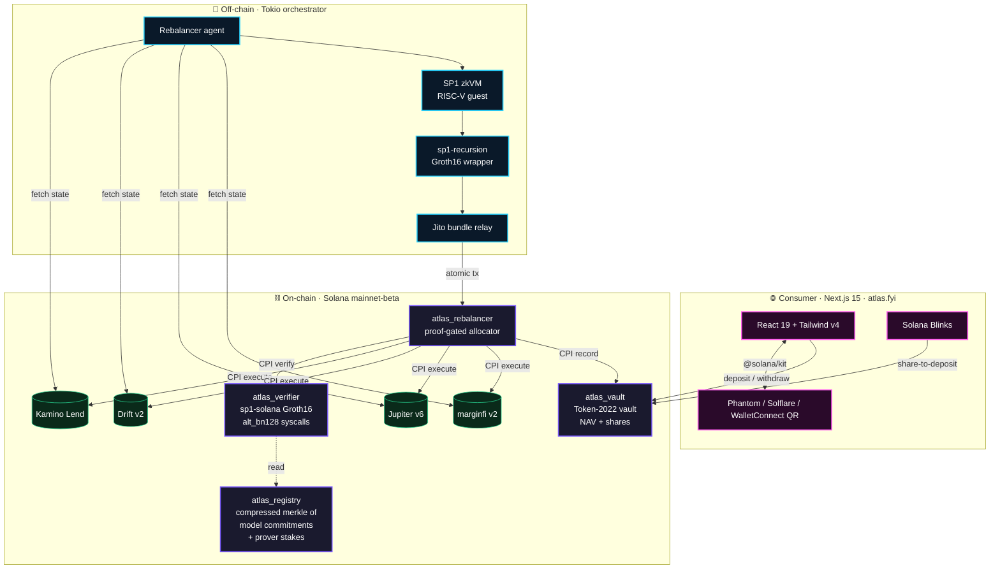
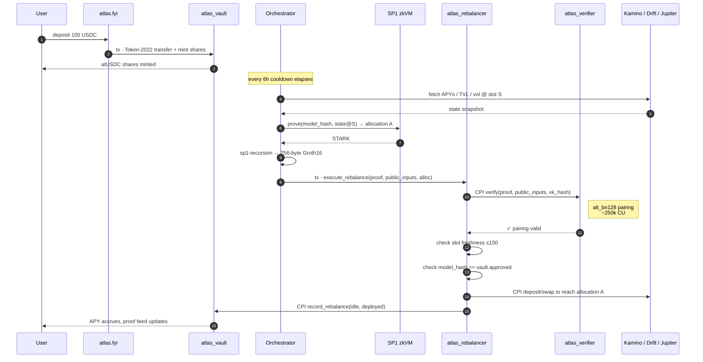
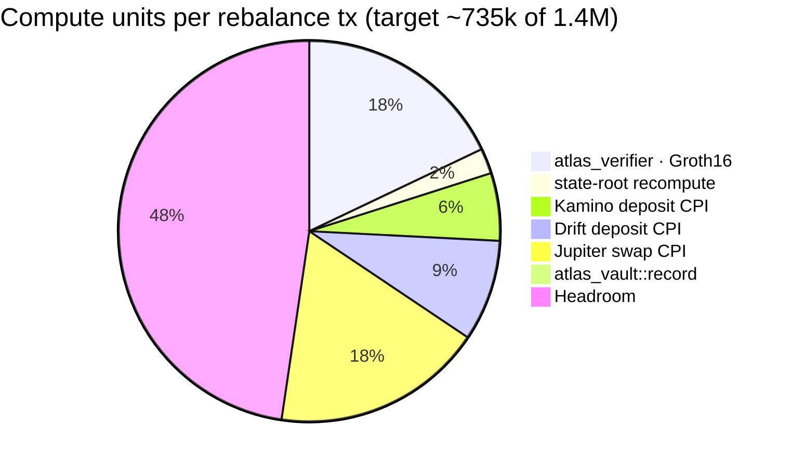
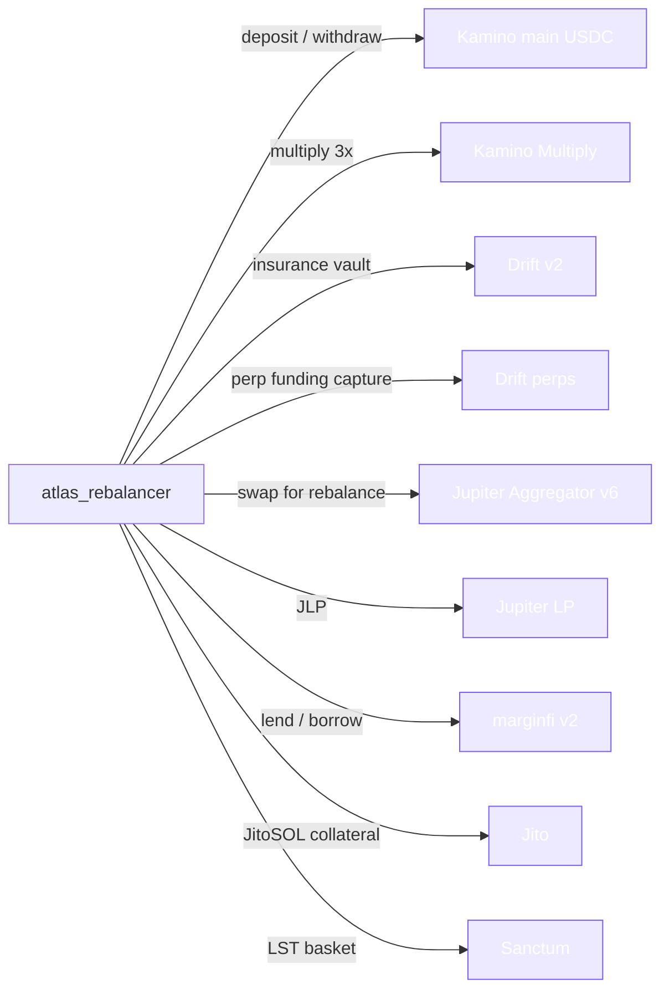
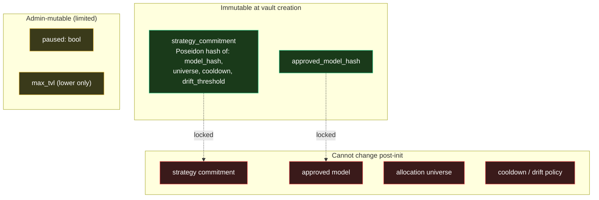
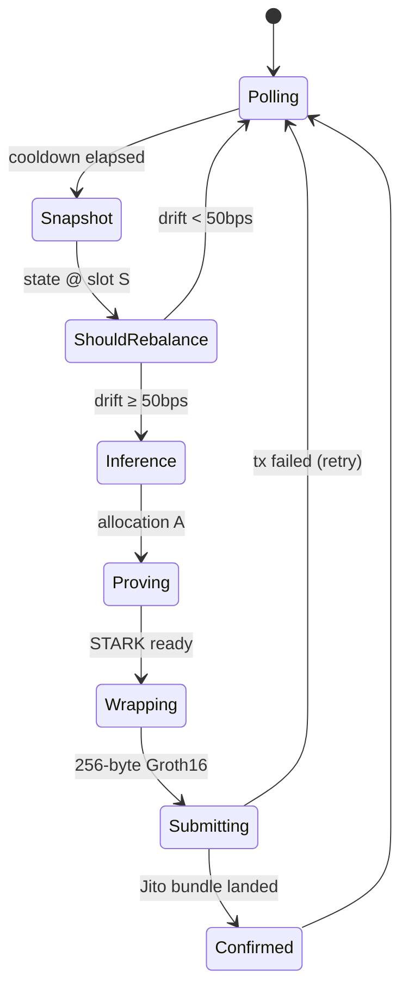
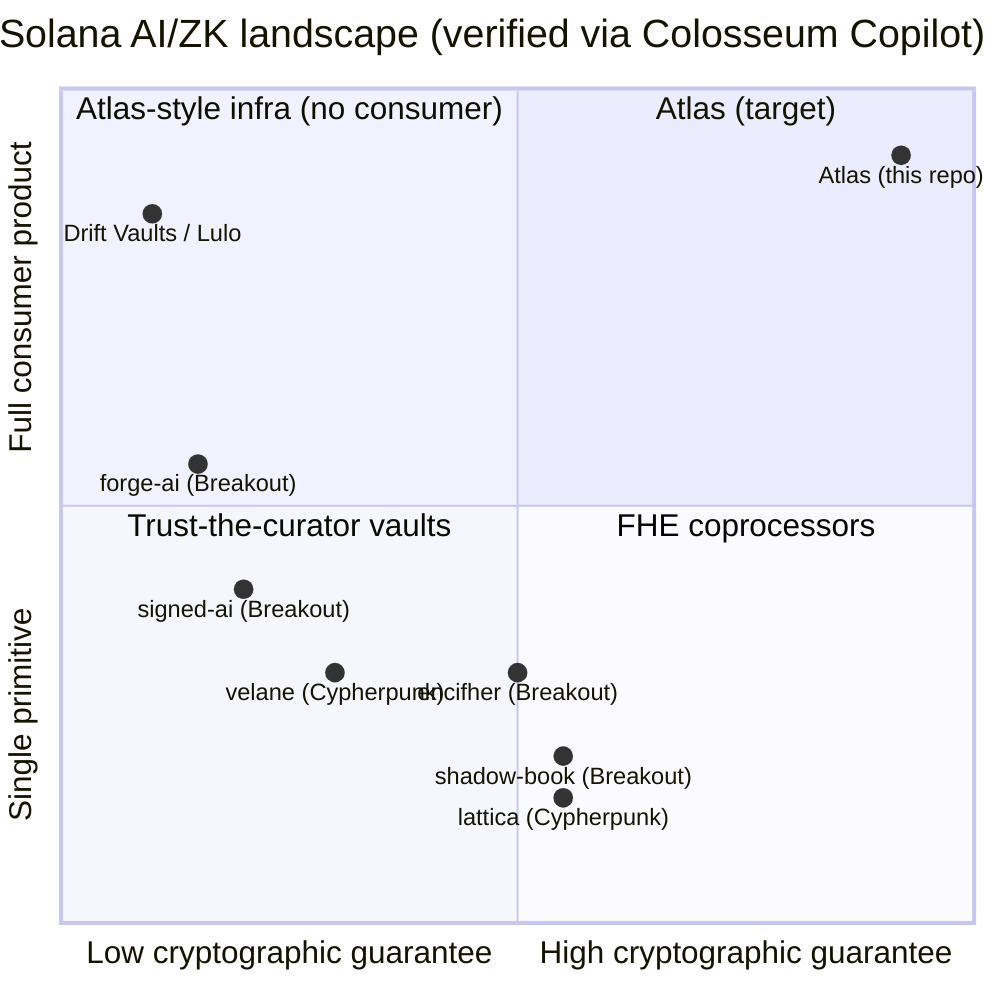

<div align="center">

# ⚡ Atlas

**Verifiable AI DeFi for Solana**

Consumer DeFi where AI rebalances USDC across Kamino, Drift, Jupiter, and marginfi — and every move ships with an SP1 zkVM proof that Solana itself verifies onchain before any of your USDC moves.

[](https://www.colosseum.com)
[](https://succinct.xyz)
[](./LICENSE)
[](https://www.anchor-lang.com)
[](https://spl.solana.com/token-2022)

[**🌐 atlas.fyi**](https://atlas.fyi) · [**📜 Architecture**](docs/architecture.md) · [**🛡 Security**](docs/security.md) · [**📝 Grant**](docs/grant-application.md)

</div>

---

## TL;DR

Every "AI yield vault" on Solana today asks depositors to **trust the curator**. Atlas removes that requirement: the strategy is committed at deposit as a Poseidon hash, the AI agent can only rebalance with a fresh **SP1 zkVM proof**, and the Solana program **rejects the transaction** if the proof, the slot, the model, or the vault id don't match.

> **Trust the math, not the team.**

Three layers, one repo:

| Layer | Track | What |
|---|---|---|
| 🧮 **Atlas Protocol** | Infra | Open zkML coprocessor — any Solana program calls `verify_inference(model_hash, input, proof)` via CPI |
| 🏦 **Atlas Vault** | DeFi | Token-2022 USDC vault, proof-gated rebalancing across Kamino / Drift / Jupiter / marginfi |
| 📱 **atlas.fyi** | Consumer | Next.js 15 dApp — Phantom / Solflare / WalletConnect QR, live proof feed, Solana Blinks |

---

## Why now

| Constraint | Solana 2026 | EVM mainnet |
|---|---|---|
| Onchain Groth16 proof verification | **~$0.0001** (`alt_bn128` syscalls) | $5+ |
| Block time | 400 ms | ~12 s |
| Token confidentiality | Token-2022 native | snarkVM / Aztec L2 |
| Per-rebalance proof economics | viable for retail TVL | research-grade only |

`sp1-solana` Groth16 verifier is **production-shipped on mainnet** by Light Protocol + Succinct. Atlas composes audited primitives — it does not invent cryptography.

---

## System architecture



---

## End-to-end proof lifecycle



If **any** check fails — proof, slot, model, vault id, CU budget — the entire transaction reverts before USDC moves.

---

## Public-input layout (136 bytes)

The orchestrator commits exactly five values inside the SP1 guest, and the rebalancer parses them onchain in this fixed layout. Mismatch = hard error.

```text
┌─────────┬──────┬──────────────────────────────────────────────────────────────┐
│ offset  │ size │ field                                                        │
├─────────┼──────┼──────────────────────────────────────────────────────────────┤
│ 0       │ 32   │ state_root      poseidon(vault_id ‖ slot ‖ balances[…])     │
│ 32      │ 32   │ alloc_root      poseidon(allocation_vector_le_f32)          │
│ 64      │  8   │ slot            u64 LE — proven against this slot           │
│ 72      │ 32   │ vault_id        target vault Pubkey                          │
│ 104     │ 32   │ model_hash      must equal vault.approved_model_hash         │
└─────────┴──────┴──────────────────────────────────────────────────────────────┘
total: 136 bytes
```

---

## Compute budget budget (target)



Mollusk regression suite in CI fails the build if any step blows its envelope.

---

## DeFi integrations



15 vault definitions ship at launch covering 8 categories: Stable / Volatile / LST / Hybrid / RWA / LP / Mixed / Aggressive — see [`web/lib/vaults.ts`](web/lib/vaults.ts).

---

## Trust model



Admin on mainnet is a **Squads multisig**. Withdraws are **never** gated on proofs — exits cannot be censored.

---

## Off-chain proof pipeline



Cooldown ≥ 4h. Proof generation ~30–90s on RTX 4090 (RunPod). Latency non-binding for vault rebalance cadence.

---

## Repo layout

```
atlas/
├── programs/
│   ├── atlas-verifier/      ← onchain Groth16 verifier (sp1-solana wrapper)
│   ├── atlas-registry/      ← compressed merkle of approved models + prover stakes
│   ├── atlas-vault/         ← Token-2022 USDC vault, NAV + shares + strategy commit
│   └── atlas-rebalancer/    ← proof-gated allocator, CPI to all DeFi venues
├── prover/
│   ├── zkvm-program/        ← SP1 RISC-V guest — proves MLP inference + state-root
│   ├── orchestrator/        ← Tokio service: fetch → prove → submit Jito bundle
│   └── model/               ← PyTorch trainer + ONNX → binary weights
├── sdk/
│   ├── rust/                ← Rust client (PDAs + ix builders) → crates.io
│   └── ts/                  ← TypeScript client (Codama-generated) → npm
├── web/                     ← Next.js 15 app at atlas.fyi
│   ├── app/                 ← /, /vaults, /vaults/[symbol], /markets, /markets/[pool], /how-it-works, /proofs
│   ├── components/          ← AmbientBackground, ProofPipeline, AllocationChart, WalletPickerModal, …
│   ├── hooks/               ← useSolBalance, useSolanaYields
│   └── lib/                 ← atlas.ts (tx builder), markets.ts (DeFiLlama), vaults.ts (15 vault defs)
├── tests/
│   ├── litesvm/             ← fast Anchor unit tests
│   ├── surfpool/            ← mainnet-fork integration (real Kamino/Drift/Jupiter accounts)
│   └── mollusk/             ← compute-budget regression suite
├── infra/
│   ├── runpod/              ← Dockerfile · GPU prover image (CUDA 12.4 + SP1 cuda mode)
│   └── fly/                 ← orchestrator deploy on Fly.io
└── docs/
    ├── architecture.md      ← deep dive · trust model · CU budget · failure modes
    ├── security.md          ← threat model · audit checklist · privileged keys
    └── grant-application.md ← Superteam Earn submission
```

---

## Quickstart

```bash
# 1. Toolchain
rustup default stable
cargo install --locked --git https://github.com/coral-xyz/anchor anchor-cli --tag v0.32.1
curl -L https://sp1.succinct.xyz | bash && sp1up

# 2. Programs
git clone https://github.com/Sushant6095/Atlas-protocol-colosseum-solana atlas
cd atlas
anchor build

# 3. Train MLP + bake binary weights for the SP1 guest
cd prover/model && pip install -r requirements.txt && python train.py

# 4. Build SP1 guest + run an end-to-end proof locally
cd ../zkvm-program && cargo prove build

# 5. Web app — atlas.fyi
cd ../../web && pnpm install && pnpm dev
# → http://localhost:3000
```

---

## Tech stack inventory

| Layer | Tech |
|---|---|
| **Onchain framework** | Anchor 0.31, Solana 2.1 |
| **zkVM verifier** | `sp1-solana` v4 (Groth16, alt_bn128 syscalls) |
| **Hashing** | `solana_program::poseidon` syscall |
| **State compression** | mpl-bubblegum / Light Protocol concurrent merkle |
| **Tokens** | SPL Token-2022 + Confidential Transfer + Transfer Hook |
| **Compute** | `request_heap_frame`, Versioned Tx, Address Lookup Tables |
| **DeFi CPI** | Kamino Lend, Drift v2, Jupiter v6, marginfi v2 |
| **zkVM (off-chain)** | SP1 v4 (Succinct), sp1-recursion → Groth16 (BN254) |
| **Off-chain runtime** | Rust 1.85, Tokio, ndarray, ONNX |
| **Tx submission** | Jito ShredStream + bundles |
| **Web** | Next.js 15 (App Router, Turbopack), React 19, Tailwind v4, framer-motion |
| **Solana SDK (TS)** | `@solana/kit`, `@solana/wallet-adapter`, `@solana/actions` (Blinks), Codama-generated client |
| **Wallets** | Phantom, Solflare, WalletConnect (QR mobile) |
| **DeFi data** | DeFiLlama Yields API (live Solana APYs/TVL across 60+ pools) |
| **DevOps** | Surfpool (mainnet fork), LiteSVM (unit), Mollusk (CU bench), GitHub Actions, Fly.io, RunPod |
| **Languages** | Rust 80% · TypeScript 15% · Python 3% · SQL 2% |

---

## Status

| Phase | Scope | Status |
|---|---|---|
| **Phase 1** | Repo scaffold · 4 program skeletons · SP1 guest · orchestrator · web app · 15 vaults · DeFiLlama integration · WalletConnect QR · real devnet deposit flow | ✅ shipped |
| **Phase 2** | sp1-solana CPI wired · vault deposit/withdraw on devnet · MLP guest end-to-end proof · first Kamino CPI · Mollusk benchmarks | 🚧 Apr 30 → May 8 |
| **Phase 3** | Drift + Jupiter + marginfi CPIs · Blinks live · proof feed pulling onchain events · mainnet-beta deploy · open SDK published · 3-min demo | 🚧 May 9 → May 12 |

---

## Differentiation (verified)

A search across all four prior Colosseum hackathons — **Renaissance · Radar · Breakout · Cypherpunk** — plus accelerator alumni and prize winners, returned **zero** projects shipping zk-proof of AI model execution on Solana.



Closest analogs (signed-ai, forge-ai, velane) **skip proof of execution** entirely. Adjacent FHE work (shadow-book, lattica, encifher) targets a **different primitive** (private state ≠ verifiable compute). Atlas is the first to combine zkML, Solana DeFi composability, and a consumer surface in one product.

---

## Security posture

- **Strategy commitment is immutable** post `init_vault` — admin cannot rotate the model
- **Admin** (Squads multisig on mainnet) can only `pause` and **lower** `max_tvl`
- **Withdraw is permissionless** — never gated on proofs; exits cannot be censored
- **Proof freshness** — proven slot must be ≤ 150 slots stale (~60 s @ 400 ms blocks)
- **Prover bonds** — Token-2022 escrow with slashing on bad proofs (registered in `atlas_registry`)
- **Reentrancy** — no callbacks; CPIs go strictly outward (vault → DeFi)
- **Integer overflow** — all arithmetic via `checked_*`, no `unwrap()` in program code
- **CU regression** — Mollusk suite fails CI if any step exceeds budget

Full threat model in [`docs/security.md`](docs/security.md).

---

## Funding

Submitted to the **Superteam Earn Agentic Engineering Grant** — fixed **200 USDG**.

| Item | USDG |
|---|---|
| RunPod RTX 4090 GPU prover (~14 days) | 100 |
| Solana mainnet rent + priority fees | 40 |
| Fly.io orchestrator hosting | 20 |
| Vercel Pro + atlas.fyi domain | 40 |

Application: [`docs/grant-application.md`](docs/grant-application.md).

---

## Roadmap beyond hackathon

| Quarter | Milestone |
|---|---|
| Q3 2026 | Independent smart-contract audit · public bug bounty (Immunefi) · TVL cap raised after 30 days clean operation |
| Q4 2026 | Permissionless prover network · staking + slashing UI · sp1-cuda fleet via cluster orchestrator |
| Q1 2027 | atSOL-leveraged + atFunding-v1 vaults to mainnet · Solana Mobile dApp Store native build · institutional onramp via PRIME RWA |
| Q2 2027 | Atlas SDK 1.0 — verified inference primitive used by 10+ Solana programs |

---

## Acknowledgements

Built on the shoulders of giants: [Succinct Labs (SP1)](https://succinct.xyz), [Light Protocol (sp1-solana)](https://lightprotocol.com), [Anchor](https://anchor-lang.com), [Kamino](https://kamino.finance), [Drift](https://drift.trade), [Jupiter](https://jup.ag), [marginfi](https://marginfi.com), [Jito](https://jito.network), [DeFiLlama](https://defillama.com), [Solana](https://solana.com).

---

## License

[Apache-2.0](./LICENSE) · 🤖 Built with [Claude Code](https://claude.com/claude-code) on [solana.new](https://solana.new) · Frontier 2026
